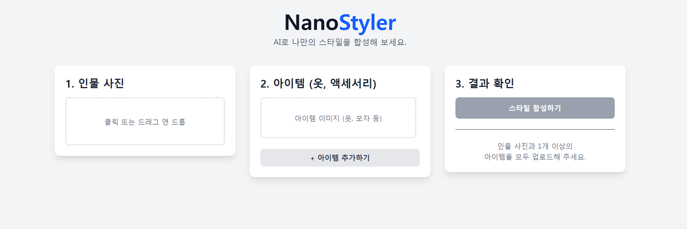

# 🎨 StyleKit (스타일킷)

AI 기반의 가상 패션 합성 웹 앱

N:1 멀티모달(Multimodal) AI 모델을 활용하여, 1명의 인물 사진과 N개의 아이템(옷, 액세서리) 사진을 합성해 1장의 최종 결과 이미지를 생성하는 SvelteKit 프로젝트입니다.



## ✨ 핵심 기능

- **AI 이미지 합성**: 1명의 인물과 N개의 아이템 이미지를 Google AI에 전송하여 1장의 합성된 이미지를 반환받습니다.

- **(1+N) → 1 멀티모달 지원**: 여러 개의 이미지를 프롬프트에 포함하여 AI가 모든 이미지를 동시에 이해하고 처리하도록 요청합니다.

- **동적 아이템 슬롯**: '아이템 추가' 버튼을 통해 원하는 만큼 옷, 모자, 액세서리 등의 이미지 슬롯을 동적으로 추가하거나 제거할 수 있습니다.

- **반응형 UI**: Svelte의 반응성을 활용하여 3개의 이미지가 모두 업로드되었을 때만 '합성하기' 버튼이 활성화되며, 즉각적인 이미지 미리보기를 제공합니다.

- **모던 웹 디자인**: Tailwind CSS를 기반으로 한 카드 레이아웃, 부드러운 fly, fade 트랜지션 및 로딩 애니메이션이 적용되어 있습니다.

## 🛠️ 기술 스택 (Tech Stack)

- 프론트엔드: SvelteKit, Tailwind CSS

- 백엔드: SvelteKit (API Routes - src/routes/api/synthesize/+server.ts)

- 핵심 AI: Google Generative AI (Gemini)

- 모델: gemini-2.5-flash-image (또는 N:1 멀티모달 이미지 생성이 가능한 모델)

## 🚀 시작하기

### 1. 사전 준비

Node.js: v20 이상을 권장합니다. (터미널에서 node -v로 확인)

- pnpm: (또는 npm/yarn)

- Google AI API 키:
  - Google AI Studio 또는 Google Cloud Console에서 API 키를 발급받아야 합니다.
  - **중요**: gemini-2.5-flash-preview-image 모델은 유료 플랜 및 결제(Billing)가 활성화되어 있어야 사용할 수 있습니다. (429 에러 방지)

### 2. 설치 및 실행

1. 프로젝트를 클론합니다.

   ```
   git clone https://github.com/sw347/nanostyler.git
   cd stylekit
   ```

2. 패키지를 설치합니다.

   ```
   pnpm install
   ```

3. 환경 변수 설정 프로젝트 루트 디렉터리(nanostyler)에 .env 파일을 생성하고, 발급받은 API 키를 입력합니다.

   ```
   # .env

   # Google AI API 키
   # SvelteKit 백엔드($env/static/private)에서 읽어들입니다.
   GOOGLE_AI_KEY="AIzaSy...[당신의-API-키]"
   ```

4. 개발 서버를 실행합니다.

   ```
   pnpm run dev
   ```

5. 브라우저에서 `http://localhost:5173`으로 접속합니다.

## 🏗️ 아키텍처

이 프로젝트는 SvelteKit의 풀스택 기능을 활용하여 프론트엔드와 백엔드를 분리했습니다.

- `src/routes/+page.svelte` (프론트엔드)
  - 사용자로부터 (1+N)개의 이미지 파일(File 객체)을 받습니다.
  - `FormData`를 구성하여 백엔드 API (`/api/synthesize`)로 POST 요청을 보냅니다.
  - 백엔드로부터 응답받은 이미지 버퍼(Blob)를 `resultImageUrl`로 변환하여 화면에 띄웁니다.

- `src/routes/api/synthesize/+server.ts` (백엔드)
  - **[보안]** API 키를 서버 측에서만 안전하게 관리합니다. (`$env/static/private`)
  - 프론트엔드에서 받은 `FormData`의 파일들을 AI가 이해할 수 있는 `inlineData` (Base64) 형식으로 변환합니다.
  - 텍스트 프롬프트와 (1+N)개의 이미지 파트를 조합하여 Google AI(`GoogleGenAI`) 라이브러리를 호출합니다.
  - AI가 반환한 응답(`result.candidates[0].content.parts`)에서 inlineData를 추출합니다.
  - 추출한 이미지 데이터를 Buffer로 변환하여 Response 객체로 프론트엔드에 return 합니다.
